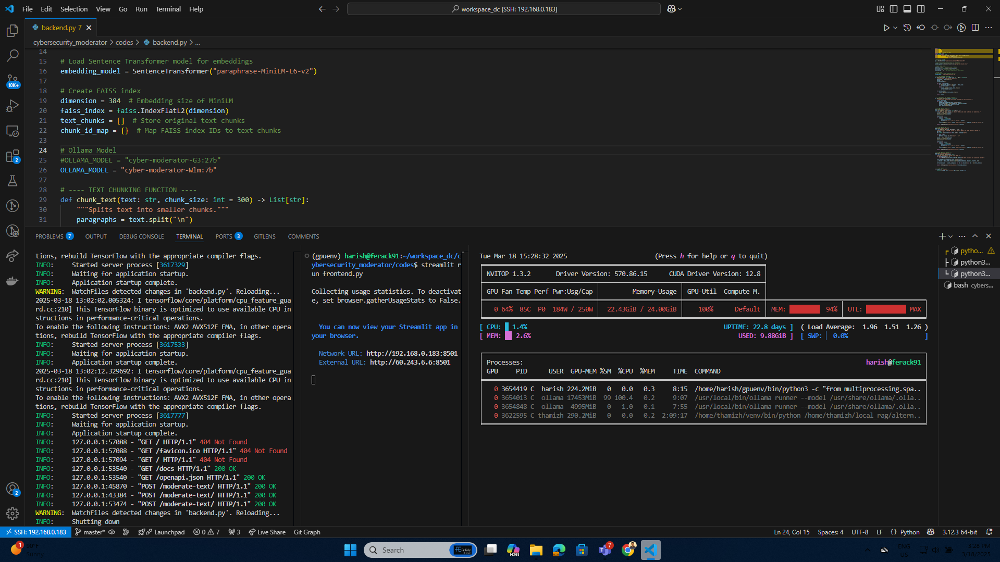
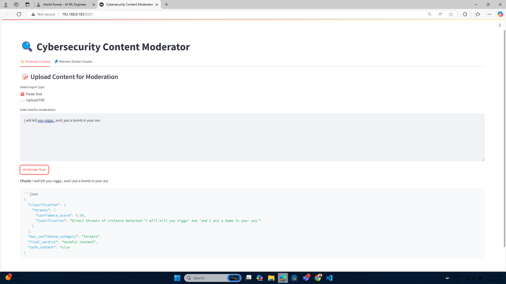
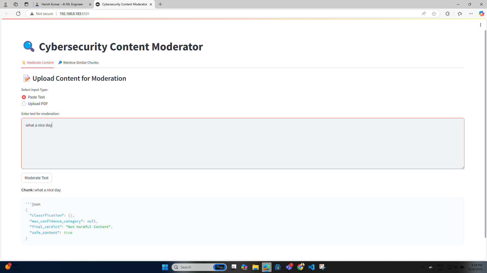
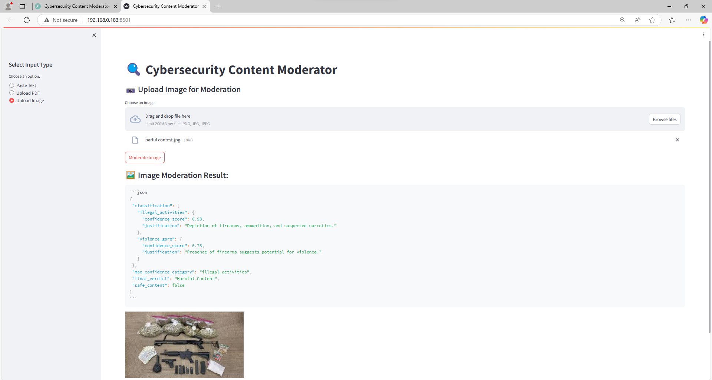
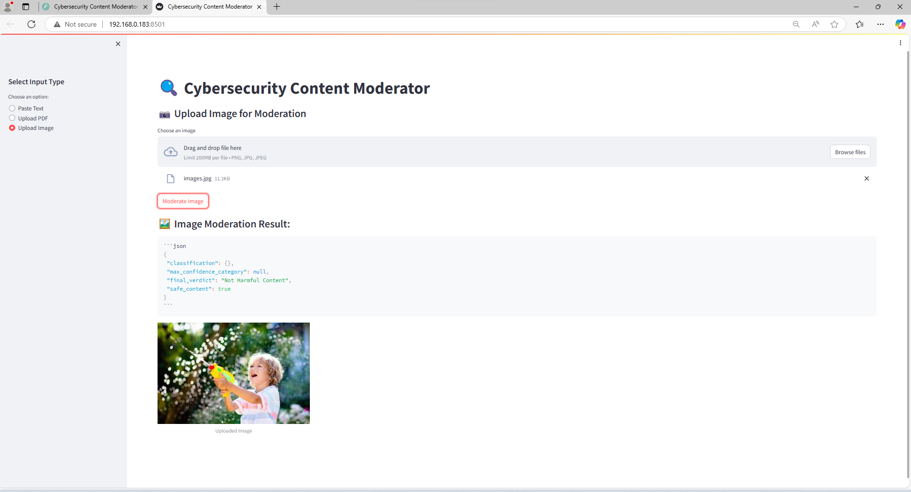
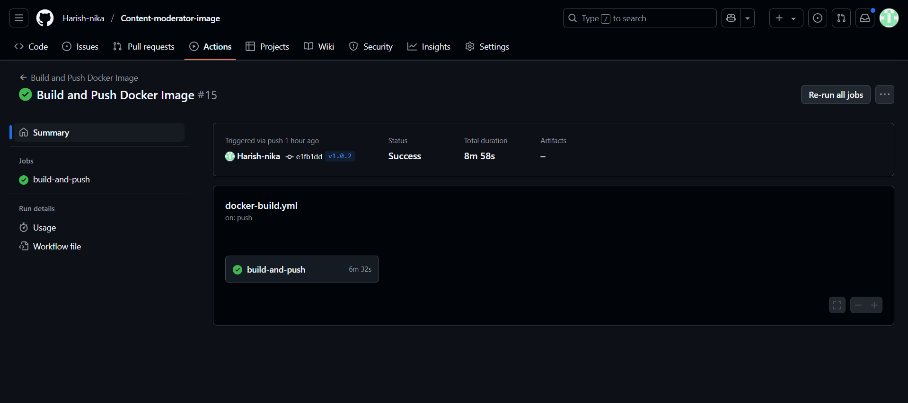
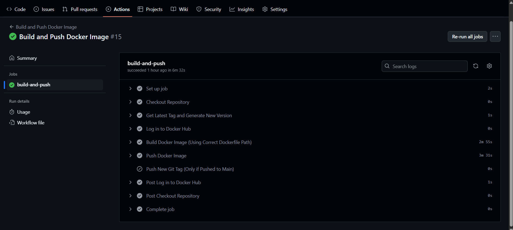

# Cybersecurity Content Moderator

## Overview
This project is a **Cybersecurity Content Moderator** that uses an **Ollama LLM model** (`cyber-moderator-Wlm:7b`) to detect and classify harmful content. It integrates **FastAPI** for the backend and **Streamlit** for the frontend, with **FAISS** for efficient similarity search.

---

## Features
- ✅ **Text,image  & PDF Moderation**: Supports both plain text ,image and PDF files.
- 🤖 **AI-Powered Content Analysis**: Uses a custom-trained Ollama model.
- 🔍 **Semantic Search**: Retrieves similar content using **FAISS** and **Sentence Transformers**.
- 🖥 **User-Friendly UI**: Built with Streamlit.

---

## API Endpoints
| Endpoint         | Method | Description |
|-----------------|--------|-------------|
| `/upload-text or upload-image/` | POST   | Accepts text,image for moderation |
| `/upload-pdf/`  | POST   | Accepts a PDF file for analysis |


---

## Installation (Without Containerization)

### Prerequisites
Ensure you have the following installed:
- Python 3.10+
- Ollama installed and running
- GPU support for model inference (recommended)

### Clone the Repository
```bash
git clone https://github.com/harish-nika/cybersecurity_moderator.git
cd cybersecurity_moderator/codes
```

### Create a Virtual Environment
```bash
python -m venv gpuenv
source gpuenv/bin/activate  # On Linux/macOS
gpuenv\Scripts\activate  # On Windows
```

### Install Dependencies
```bash
pip install --no-cache-dir -r requirements.txt
```

---

## Model Setup (Ollama)

### 1️⃣ Create and Configure the Ollama Model File
Navigate to the `modelfiles` directory and create an Ollama `Modelfile`:

```bash
cd /home/harish/workspace_dc/cybersecurity_moderator/modelfiles/
nano Modelfile
```

Inside the `Modelfile`, define your model configuration:

```dockerfile
# Ollama Model Configuration File use any ollama model based on your resourec and preference
FROM wizardlm2:7b
SYSTEM "Cybersecurity content moderation model"
PARAMETER "temperature" 0.7
PARAMETER "top_p" 0.9
```

Save and exit (`Ctrl + X`, then `Y`, and `Enter`).

### 2️⃣ Build the Ollama Model
```bash
ollama create cyber-moderator-Wlm:7b -f /home/harish/workspace_dc/cybersecurity_moderator/modelfiles/Modelfile
```

### 3️⃣ Verify the Model
```bash
ollama list
```

### 4️⃣ Start Using the Model
```bash
OLLAMA_USE_CUDA=1 ollama run cyber-moderator-Wlm:7b "Analyze this message for harmful content."
```

---

## Running the Application (Without Containerization)

### Start the Backend (FastAPI)
```bash
chmod +x /app/backend/start.sh
bash /app/backend/start.sh
```

### Start the Frontend (Streamlit)
```bash
chmod +x /app/frontend/start_frontend.sh
bash /app/frontend/start_frontend.sh
```

---

# Content Moderator - Containerization Guide

## Docker Login & Pull Image

### Log in to Docker
```bash
docker login -u harishkumarthesde
```
Enter your **Docker Hub password** when prompted.

### Pull the Pre-Built Docker Image
```bash
docker pull harishkumarthesde/content-moderator:latest
```
## Note 
This repository contains the Content Moderator system, which is designed for detecting harmful content. The system runs inside a Docker container and supports GPU acceleration.

## Prerequisites
- Might be slow based on your GPU Specs
- Docker or Podman installed on your system
- NVIDIA GPU (if using GPU acceleration)
- Proper NVIDIA drivers and CUDA installed
- Access to the container image: `harishkumarthesde/content-moderator:latest`

## Running the Container
### 1️⃣ Stop & Remove Existing Container (If Running)
If a container with the same name already exists, stop and remove it before running a new one:
```bash
# Stop the existing container
docker stop content-moderator-container

# Remove the existing container
docker rm content-moderator-container
```

### 2️⃣ Run the Container with GPU Support
To start the content moderator with GPU acceleration, run:
```bash
docker run --gpus all -p 8000:8000 -p 8501:8501 --name content-moderator-container harishkumarthesde/content-moderator:latest
```

### 3️⃣ Alternative: Use `--replace` with Podman
If using Podman, you can replace an existing container using:
```bash
docker run --replace --gpus all -p 8000:8000 -p 8501:8501 --name content-moderator-container harishkumarthesde/content-moderator:latest
```

## Accessing the Application
- **FastAPI Server**: Runs on `http://localhost:8000`
- **Streamlit UI**: Accessible at `http://localhost:8501`

## Viewing Logs
To check logs of the running container:
```bash
docker logs -f content-moderator-container
```

## Stopping the Container
To stop the running container:
```bash
docker stop content-moderator-container
```

## Removing the Container
To remove the container completely:
```bash
docker rm content-moderator-container
```

## Updating the Container
If you update the image and want to redeploy:
```bash
# Pull the latest image
docker pull harishkumarthesde/content-moderator:latest

# Remove the old container
docker stop content-moderator-container
docker rm content-moderator-container

# Run the updated container
docker run --gpus all -p 8000:8000 -p 8501:8501 --name content-moderator-container harishkumarthesde/content-moderator:latest
```

## Troubleshooting
- **Check running containers:**
  ```bash
  docker ps
  ```
- **Check container logs:**
  ```bash
  docker logs content-moderator-container
  ```
- **Check GPU availability:**
  ```bash
  nvidia-smi
  ```


## Project Structure
```
Content-moderator-image/
│-- backend/
│   ├── backend.py  # FastAPI backend
│   ├── start.sh  # Backend start script
│   └── requirements.txt  # Dependencies
│
│-- frontend/
│   ├── frontend.py  # Streamlit frontend
│   ├── start_frontend.sh  # Frontend start script
│   └── requirements.txt  # Dependencies
│
│-- models/
│   └── Modelfile  # Ollama model configuration
│
│-- docker/
│   └── Dockerfile  # Docker build instructions
│
│-- start_service.sh  # Master startup script
│-- docker-compose.yml  # Docker Compose configuration
```

---

## Containerization Process
### **1. Dockerfile**
```dockerfile
# Use official Python image
FROM python:3.10

# Set the working directory inside the container
WORKDIR /app

# Copy application files
COPY . .

# Install dependencies
RUN pip install --no-cache-dir -r backend/requirements.txt

# Install Ollama
RUN curl -fsSL https://ollama.com/install.sh | sh

# Expose necessary ports
EXPOSE 8000 8501

# Make scripts executable
RUN chmod +x start_service.sh backend/start.sh frontend/start_frontend.sh

# Use ENTRYPOINT instead of CMD for better control
ENTRYPOINT ["/bin/bash", "start_service.sh"]
```

### **2. Docker Compose Configuration (`docker-compose.yml`)**
```yaml
version: "3.8"

services:
  ollama:
    image: ollama/ollama
    container_name: ollama_server
    restart: always
    ports:
      - "11434:11434"
    volumes:
      - ./models:/root/.ollama/models  # Persist model files
    healthcheck:
      test: ["CMD", "ollama", "list"]
      interval: 10s
      retries: 3

  backend:
    build: .
    container_name: content_moderator_backend
    depends_on:
      ollama:
        condition: service_healthy
    ports:
      - "8000:8000"
    volumes:
      - .:/app
    command: ["/bin/bash", "/app/backend/start.sh"]

  frontend:
    build: .
    container_name: content_moderator_frontend
    depends_on:
      - backend
    ports:
      - "8501:8501"
    volumes:
      - .:/app
    command: ["/bin/bash", "/app/frontend/start_frontend.sh"]
```

### **3. Build and Run the Docker Container**
```bash
docker-compose up --build
```
To stop:
```bash
docker-compose down
```
### **3.1. frontend  Configuration (`start_services.sh`)**
```sh
#!/bin/bash

#!/bin/bash

echo "🔄 Starting Ollama server..."
ollama serve &

# Wait for Ollama to start
sleep 10  # Ensure Ollama is running before pulling models

echo "📥 Pulling base model..."
ollama pull wizardlm2:7b
ollama pull gemma3:12b 

echo "🛠 Creating custom moderation model..."
ollama create cyber-moderator-Wlm:7b -f /app/models/Modelfile  # Absolute path
ollama create cyber-moderator-G3:12b  -f /app/models/Modelfile_vision

echo "🚀 Starting Backend..."
bash /app/backend/start.sh &

echo "🎨 Starting Frontend..."
bash /app/frontend/start_frontend.sh


```

### **3.2. frontend  Configuration (`start_frontend.sh`)**
```sh
#!/bin/bash

echo "🎨 Starting Streamlit Frontend..."
cd /app/frontend  # Ensure correct directory
streamlit run frontend.py --server.port 8501 --server.address 0.0.0.0

```

### **3.3. backend  Configuration (`start.sh`)**
```sh
#!/bin/bash

echo "🚀 Starting FastAPI Backend..."
cd /app/backend  # Ensure correct directory

# Ensure correct module path
uvicorn backend:app --host 0.0.0.0 --port 8000 --reload

```

### **4. Build and Run the Docker Container**
```bash
docker-compose up --build
```
To stop:
```bash
docker-compose down
```

### **5. workflow  Configuration (`docker-build.yml`)**
```yaml
name: Build and Push Docker Image

on:
  push:
    branches:
      - main
    tags:
      - 'v*'  # Trigger build on version tags (e.g., v1.0.1)
  workflow_dispatch:  # Allow manual execution

jobs:
  build-and-push:
    runs-on: ubuntu-latest

    steps:
    - name: Checkout Repository
      uses: actions/checkout@v4
      with:
        fetch-depth: 0  # Fetch all history to properly detect tags

    - name: Get Latest Tag and Generate New Version
      id: versioning
      run: |
        git fetch --tags
        LATEST_TAG=$(git tag --sort=-v:refname | head -n 1)
        if [ -z "$LATEST_TAG" ]; then
          NEW_TAG="v1.0.0"
        else
          NEW_TAG=$(echo "$LATEST_TAG" | awk -F. -v OFS=. '{ $NF += 1 ; print }')
        fi
        echo "NEW_TAG=$NEW_TAG" >> $GITHUB_ENV
        echo "Generated new version: $NEW_TAG"

    - name: Log in to Docker Hub
      uses: docker/login-action@v3
      with:
        username: ${{ secrets.DOCKER_USERNAME }}
        password: ${{ secrets.DOCKER_PASSWORD }}

    - name: Build Docker Image
      run: |
        docker build -t harishkumarthesde/content-moderator:latest -f Dockerfile .
        docker tag harishkumarthesde/content-moderator:latest harishkumarthesde/content-moderator:${{ env.NEW_TAG }}

    - name: Push Docker Image
      run: |
        docker push harishkumarthesde/content-moderator:latest
        docker push harishkumarthesde/content-moderator:${{ env.NEW_TAG }}

    - name: Push New Git Tag (Only if Pushed to Main)
      if: github.ref == 'refs/heads/main'
      run: |
        git config --global user.email "harishkumar56278@gmail.com"
        git config --global user.name "harish-nika"
        git tag -a ${{ env.NEW_TAG }} -m "Release ${{ env.NEW_TAG }}"
        git push --force origin ${{ env.NEW_TAG }}
      env:
        GITHUB_TOKEN: ${{ secrets.PAT_TOKEN }}  # Use a personal access token (PAT)


```


---

## **Output Screenshots**
### Backend Processing Output


### Streamlit Moderation TEXT MODEL Interface Output


### Streamlit Moderation TEXT MODEL Interface Output



### GitHub Actions Build & Run Output



---

## **License**
This project is licensed under the **MIT License**.

## **Author**
- **Harish Kumar S**
- GitHub: [Harish-nika](https://github.com/Harish-nika)
- Email: [harishkumar56278@gmail.com](mailto:harishkumar56278@gmail.com)
- Portfolio: [Harish Kumar S - AI ML Engineer](https://harish-nika.github.io/)

